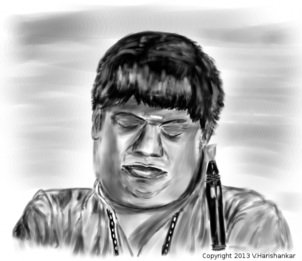

# Nathas, your Slack DJ



## Usage

### 1. Creating 3rd party accounts
- Create a Slack Bot for your team.
- Create a project on Google Developer console to access YouTube.

### 2. Download the code
Clone or fork this repo to your machine and install the dependencies.
```
pip install -r requirements.txt
```

### 3. Environmental Variables

`SLACK_BOT_TOKEN`: This is the HTTP API Token you obtained when creating the bot.
`BOT_ID`: Once you have created a Slack Bot, *run get_bot_id.py*
`YT_DEVELOPER_KEY`: Youtube developer key to access Data API.
`NATHAS_UI_ENDPOINT`: IP address and port number of the UI application.
